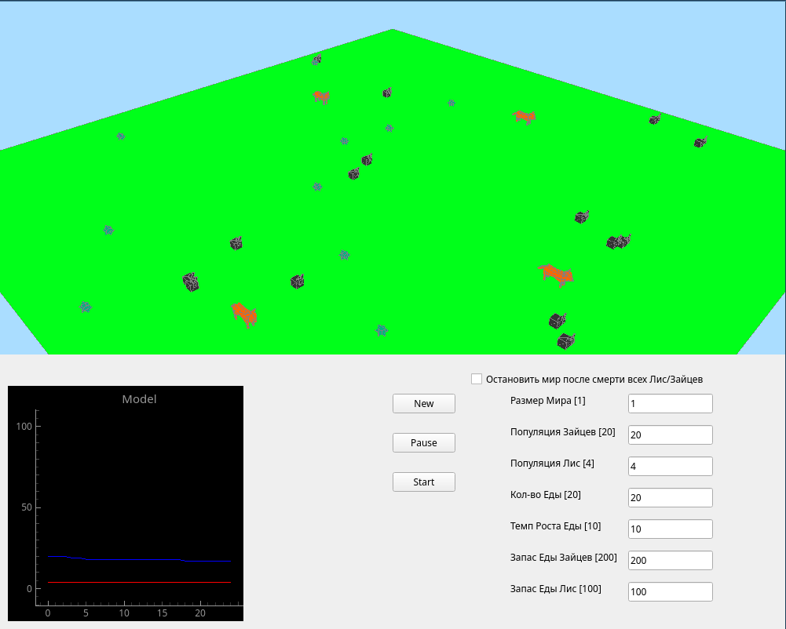

# Rabits and foxes simulation
This is a small student project. It simulates a victim-hunter model. You have a controls over the poulation, amount of food etc.



## How to run
Simply run `python main.py` or `make start` command

## Translation
To change language run 
```
make changelang lang={lang_code}
```
where `lang_code` is your language code. for example `en` or `ru`
now supports only **engilsh** and **russian**

## Dependencies
+ `pyqtgraph`
+ `PyQt6`
+ `numpy`

## P.S.
I only fixed and refactor it a little bit so it is a little more comfortable to use (why???). It runs poorly and overall is a piece of crap)
So `main.py` is interface and stuff, `log.py` probably stands fod "logic" (even I'm not sure) and contains the main app logic. It is such a codedump! But in the very begining there is a simple .obj parser so if you need it in your python project you can use it
